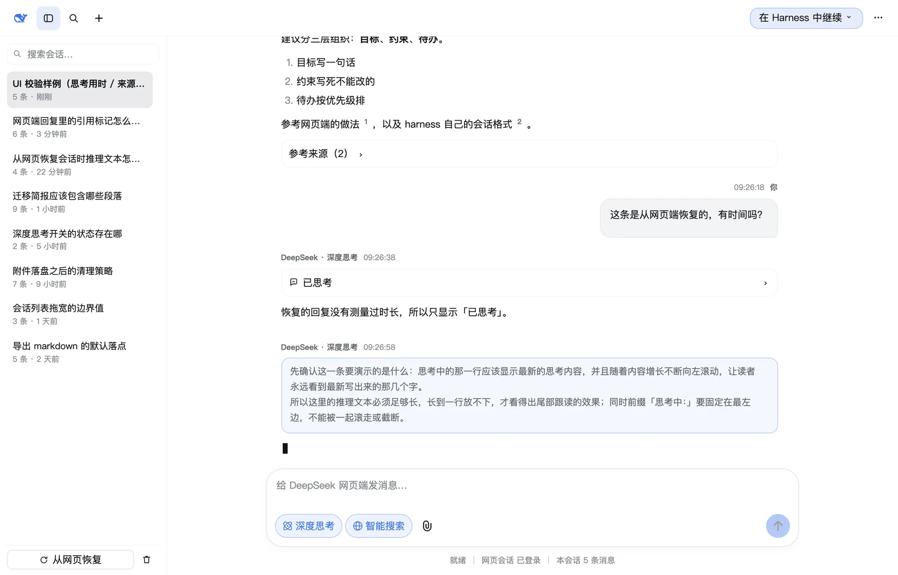
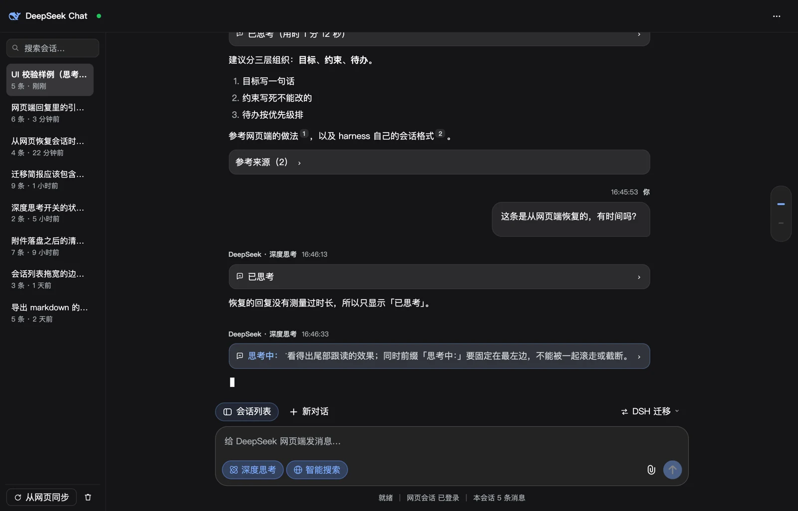
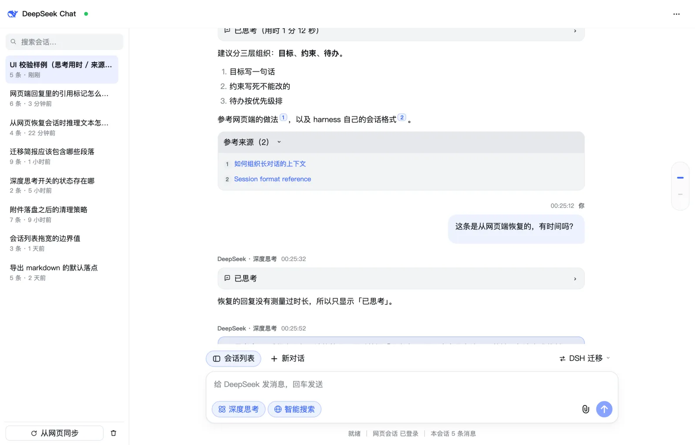

# dsh-DSchat

在 DeepSeek Harness 桌面版里，用**原生面板**聊 DeepSeek 网页端（chat.deepseek.com），
聊完把整段对话迁移成 harness 会话继续开发 —— 复用你的网页登录，不消耗 API 额度。

包名 `dsh-dschat`（npm 强制小写），界面上显示为 **dsh-DSchat**。

| 浅色 | 深色 |
|---|---|
|  |  |

思考用时（流式期间实测）、正文里的 `[citation:N]` 芯片、默认收起的参考来源：



> 这三张是**真实组件**在真实浏览器 + DSH 自己的主题表里渲染出来的
> （`node scripts/ui-shot.mjs --synthetic`），会话列表是合成样例 ——
> 脚本默认读本机真实记录，`--synthetic` 关掉它，公开的图里不会出现任何人的真实对话。

## 与 dsh-webchat 的关系

它是 dsh-webchat 的重写版：**浏览器引擎、网页端解析、蒸馏与迁移机制沿用**（Apache-2.0），
但界面改成 DSH 原生面板，并把整套命名空间独立成 `dsh-dschat`，两个插件可以共存。

最关键的一处改动是集成方式：

| | dsh-webchat | dsh-DSchat |
|---|---|---|
| 中心面板 | `MutationObserver` 往中心栏塞 DOM，再用 CSS 把原生会话区 `display:none` | 注册 `main` 槽位（key `dschat`），真正的原生面板 |
| 侧边栏入口 | 往侧边栏插一个按钮，还要自我修复被 React 顶掉的行 | 注册 `sidebar.panellist`（id `dschat`，order 20），与「插件」「任务」同级 |
| 设置页 | 无 | 注册 `settings.section`（id `dschat`，order 50），与「通用」「模型」「插件」同级 |
| 与会话区关系 | 互斥，靠 html 属性互相驱逐 | 无关：`main` 面板不绑定 session，切换不打断原生会话 |

这三条都有运行时证据：安装后 `cordis_inspect_query` 的 `Slots.listSubTree` 显示
`main` 的 occupants 里出现 `dschat`，`sidebar.panellist` 里出现 `id: "dschat", order: 20`。

## 功能

- **网页聊天**：真实浏览器驱动 chat.deepseek.com，流式回复，深度思考（R1）与**智能搜索**开关。
- **文件附件**：「上传文件」按钮点开 macOS 原生文件对话框（隐藏的 `<input type="file">`，
  和宿主自己的输入框走同一条路），选完即经 `/attach` 落盘并回到输入框；**粘贴（⌘V）和拖进输入区**
  走同一条落盘链路。图片、PDF、Word、Excel、PPT、txt、md 等都可以，单文件上限 24 MB、
  单条消息最多 10 个；附件 7 天后自动清理。
  这是**唯一**能拿到本地文件的入口——打包后的 harness 没有任何"返回文件路径"的原生对话框
  （唯一的原生对话框是选目录的 `dsh-desktop:directory-pick`），`ctx.fileUpload` 收的是字节、
  `ctx.conversation.pickFiles()` 只回一个 boolean，都不给路径。输入区那一排是**两组**：
  左边 **深度思考 → 智能搜索**（这条消息要怎么答），右边 **附件 → 发送**（现在就动这条消息；
  附件按钮只有图标，文字在 `aria-label` / `title` 上，位置与网页端一致——回形针是发送圆的左邻）。
- **链接一律交给本机默认浏览器**：面板里没有内嵌浏览器，也没有「点开跑到别处」的歧义——
  正文链接、`[citation:N]` 芯片、参考来源每一行都走 `window.open(url, "_blank")`，即宿主自己的
  外链通道（Electron 主进程 `setWindowOpenHandler` → `shell.openExternal`），并用系统默认浏览器
  打开；非 http(s) 协议（`mailto:` 等）不接管，仍由锚点自己处理。
- **回复里的来源排在正文之后，且默认折叠**：网页端在搜索结束时就编好了来源表（早于正文的第一个
  字），面板在**流式期间只渲染 `[citation:N]` 芯片、不渲染来源列表**，等正文结束再出一个
  「参考来源（N）」标题——顺序与网页端最终的版式一致（正文 → 参考来源），而不是「先冒出参考来源、
  再被正文顶下去」。列表默认收起（一次搜索可能引用二十个页面，全展开会把正文挤没），点标题展开。
- **思考段独立成行，带真实用时**：assistant 消息的推理不再渲染成 `<details>`，而是一个
  「已思考（用时 X 分 Y 秒）」的行——时间是引擎在流式期间**实测**的（首个推理片段 → 首个正文片段，
  见「[思考用时](#思考用时已思考用时-x-分-y-秒从哪来)」）。这一行**默认折叠，屏幕上只有一行**；
  点它才展开，展开后**只有完整推理，那一行本身不再显示**，点推理内容任意处即可收起（见
  「[一行，或者完整内容，不会同时出现](#一行或者完整内容不会同时出现)」）。**推理进行中时这一行是实时的**：
  折叠态显示「思考中：<最新的思考内容>」，单行、跟着流式内容不断左移，永远露出最新写出来的那几个字；
  推理期间它处在展开态，看到的是推理全文（滚动体自动跟到底部）——那行实时摘要属于折叠态。
  回答一开始就自动收成一行，换成用时。
  从网页恢复的会话（历史里只有推理文本、没有时间）只显示「已思考」。正文不再被折进折叠框里。
- **消息操作**：assistant 消息的「复制回复」「引用到输入框」只取**正文**，「复制思考过程」单独取
  推理段（见「正文 / 思考必须分开」）。
- **头部三个窗口按钮**：标题栏左侧是**会话列表 / 搜索 / 新建对话**（网页端自己的顺序与图标，
  34px 方块 + 16px 线性图标）。列表可以整个收起把宽度让给对话，状态记在
  `localStorage`（`dsh-dschat.rail.open`）；搜索按钮会展开列表并把光标放进搜索框。
- **会话列表可拖宽**：左侧对话记录栏右侧的拖拽条可以调宽度（170–460px，双击恢复默认，
  键盘 ←/→ 也能调），宽度记在 `localStorage`（`dsh-dschat.rail.width`）。
- **迁移到 Harness**：头部「在 Harness 中继续」，可选 *蒸馏成任务简报*（默认）或 *原文完整迁移*，
  可指定目标工作区或追加到已有会话；带三段式进度（蒸馏 → 建会话 → 打开），完成后自动跳进新会话。
- **从网页恢复**：三层来源（页面自己的 history 接口 → 应用 IndexedDB 缓存 → DOM 全量抓取），
  单会话 70–400ms 拿回**整段**对话（含思考），再次恢复会把之前导入不全的记录就地补全。
- **导出 markdown 默认进「下载」文件夹**：面板不再把文件丢进"最近那个工作区"或进程 cwd
  （`exportDir` 可改，留空即 `~/Downloads`），导完的提示给的是**完整路径**，
  因为「已导出到 dschat-….md」等于没说文件在哪。
- **会话搜索 / 删除可撤销**。
- **原生设置页**：状态、运行参数（浏览器渠道、无头、超时、数据目录、profile 目录、蒸馏模型）与
  快捷操作；参数本身在「插件」页的 dsh-DSchat 行里编辑。
- **Agent 工具**：`dschat_status` / `dschat_send` / `dschat_recover` / `dschat_import` / `dschat_transfer`。

## 安装

用 DSH 自带的插件安装器（不要手改 profile，也不要直接在 profile 里跑 pnpm）：

```
npm pack --pack-destination ~/.dsh/dsh-dschat-dist     # 先打成 tarball
plugin_manager action=install_bundle target=file:<tarball 的绝对路径>
```

安装后 `dsh.profile.bundles` 会多出 `dsh-dschat`。

**必须用 tarball，不要用 `link:`。** `link:` 会让 profile 里出现一个指向工作区的符号链接，
Node 按真实路径（即工作区）向上找 `node_modules`，插件自己的 `playwright-core` 与 harness
提供的 `@deepseek-ai/*` 都解析不到，表现为 `dsh: warning: 1 entry did not activate` 加上
`dschat (dsh-dschat): failed to import`。tarball 安装落盘的是真实目录，解析链才正确。

### 两个会让插件"静默加载失败"的坑

harness 的 loader 把插件入口的任何导入期异常都压缩成同一句 `failed to import`，
真实错误被 `ctx.logger.error()` 吞掉，日志里查不到。踩过的两个：

1. **profile 里是符号链接**（见上）。
2. **导入了不存在的具名导出**。ESM 的具名导入在链接期解析，名字对不上就抛
   `SyntaxError`，同样报成 `failed to import`。所以：
   - 宿主半区只从 `@deepseek-ai/dsh-llm` / `dsh-session` / `dsh-tools` 导入，且每个名字都
     在真实包里核对过；`@deepseek-ai/dsh-settings` **不导出** `settingsNamespace` /
     `installSettingsSection`（那是臆造的 API，真实设置能力走 `ctx.settings` 服务）。
   - `test/stubs/harness.ts` 里**只能放真实存在的导出**。桩里多一个不存在的名字，
     离线测试会通过，而线上必挂 —— 这是本项目最贵的 30 分钟。
   - 插件能在运行时导入哪些包，由**它自己 package.json 的 `dependencies` +
     `peerDependencies` 的名字集合**决定（`dsh-app-boot` 的 `profileDependencyNames`），
     所以用到的 harness 包必须显式声明为 peer。

## 目录

```
src/index.ts              宿主入口：Config schema、路由、工具、system prompt 公告
src/protocol.ts           两端共享的线协议（API 路径、数据模型、阶段推导）
src/routes.ts             /api/dsh-dschat/* 路由族（loopback 围栏）
src/tools.ts              dschat_* agent 工具
src/transfer.ts           蒸馏 / 原文迁移 / 导出
src/store.ts              本地对话记录
src/engine/engine.ts      playwright-core 驱动 chat.deepseek.com 的引擎（沿用 dsh-webchat）
src/client/index.ts       浏览器入口：locale、样式、槽位注册（panellist / main / settings.section）；
                          工作区服务面（pickDirectory / createWorkspace）按 call 取
src/client/panel/         DSchatPanel（header / rail / thread / composer，链接外开、附件走 /attach）/
                          DSchatSettings / Markdown（含 Thinking 与 SourceList 两个折叠块）/
                          reply（正文 vs 思考）/ styles
scripts/build.mjs         esbuild 构建
scripts/ui-shot.mjs       把真实面板挂进真实浏览器（Chrome）截图并量尺寸：拖宽、折叠状态、
                          布局断言都在这里看，单测只能证明「没崩」
test/host-smoke.test.ts   宿主半区：导入、路由、工具、附件落盘、/tail 的思考用时、loopback 围栏
test/streaming.test.ts    流式链路：增量解析器与整段解析等价、/tail 增量契约、落盘合并
test/reply.test.ts        正文 / 思考切分：引用与复制取正文，流式中不吐半截标签
test/client-render.test.ts 浏览器半区：组件真渲染 + 信封与槽位注册自检 + 外链接管 +
                          思考用时三种状态 + 来源列表折叠与时序 + 会话列表拖宽 +
                          composer 两组控件的位置 + 「点一下只启动一次」的接线
test/stale-reply.test.ts  上一轮回复不许被当成这一轮的答案：内容身份判据 + 假页面的
                          「只重排旧行、不给新答案」与「稍后给出新答案」两条链路
test/stale-reply-e2e.test.ts 真浏览器 e2e：本地假会话页回放同一个故障（旧答案绝不落库）
                          与它的反例（真正的新答案照常落库，含思考）
test/wake-e2e.test.ts     真浏览器 e2e：本地假聊天页上验证 wake 只启动一次、
                          「打开登录窗口」复用已登录的浏览器（不重启）
docs/screenshots/         README 顶部的三张图：真实组件 + 真实主题的渲染，
                          由 scripts/ui-shot.mjs --synthetic 的产物转成 1600px WebP
prototype/                定稿的 UI 原型与截图（静态 HTML，不是插件本身）
refs/                     从 DSH 应用包中提取的主题/侧边栏样式与插件开发指南
```

## 构建与测试

```bash
npm install --ignore-scripts   # 只装 esbuild 与 react（测试用，不执行任何安装脚本）
npm run build                  # 产出 lib/index.js 与 lib/client.js
npm test                       # 宿主半区 + 浏览器半区
node scripts/ui-shot.mjs       # 可选：真实浏览器渲染 + 截图 + 几何断言（写 .tmp-ui-shot/）
```

对着**官方网页端**量尺寸用的几个脚本（只在需要重新量一次时跑，产物落在
`scripts/ui-ref-*.mjs` 的第二个参数目录里）：

```bash
node scripts/ui-ref-shot.mjs   <out>   # 打开 chat.deepseek.com（复制登录 profile 到临时目录），
                                       # 截图 + 全量计算样式 report.json
node scripts/ui-ref-styles.mjs <out>   # 输入卡片 / 胶囊 / 头部按钮的完整样式与高清裁切
node scripts/ui-ref-dark.mjs   <out>   # 深色主题 + 开关"关闭"态（点一下再点回来，不落设置）
node scripts/ui-ref-svg.mjs    <out>   # 把官方内联 SVG 的 path 原样抠出来（icons.tsx 的来源）
node scripts/ui-ref-icons.mjs  <png>   # 把抠出来的图标放大画一遍，先看再抄
node scripts/ui-icon-check.mjs <png>   # 把 DSchat 的标和 host 自己的图标按真实渲染尺寸排一张对比图
node scripts/token-probe.mjs           # 验证 --dsw-static-deepseek-* 在宿主主题表里真的解析得到
node scripts/asar-probe.mjs <路径子串> [out]  # 只读地从 app.asar 里抠单个文件，不解包 121 MB
                                             # （宿主包的真实 API 以打包副本为准，见 refs/README.md）
```

`ui-ref-*` 需要登录态：脚本会把 `~/.dsh/dsh-webchat/browser-profile` 拷到临时目录再打开，
因为正在运行的插件引擎锁着原目录。

静态渲染证明"组件不崩"，证明不了"布局是对的"：拖拽条是否真的抓得住、工具行是否还排得下、
折叠行是否真的只有一行高，都要在真浏览器里量。`scripts/ui-shot.mjs` 用真实组件、真实样式表、
真实词条和真实会话记录（`~/.dsh/dsh-dschat/transcripts.json`）渲染一页，然后用 Chrome 截图，
并把 `getBoundingClientRect` 的结果打成 JSON——「附件在深度思考右边」「DOM 里没有 `<details>`」
「拖到 170px 后 localStorage 是 170」「胶囊点亮后底/边/字/图标同色」「思考中的那一行真的把尾部
滚到了可视区（`translateX(-超出量)`）」「点了会话列表按钮后 rail 与手柄都不在 DOM 里」
这些结论都是它给出的。

**加 `--synthetic` 才适合给别人看**：不带这个参数时，会话列表从本机真实记录
（`~/.dsh/dsh-dschat/transcripts.json`）里取，标题属于隐私；带上它就是一份固定的合成样例，
任何机器上跑出来都一样。README 顶部那三张正是这么来的：

```bash
node scripts/ui-shot.mjs --synthetic   # 产物落 .tmp-ui-shot/（含 report.json）
# 再把 01-default / 03-sources-open / 05-dark 转成 1600px WebP（q88）
# → docs/screenshots/panel-light.webp / sources-and-thinking.webp / panel-dark.webp
```

测试为什么长这样：`@deepseek-ai/*` 只在运行中的 harness 里可解析，所以宿主测试用 esbuild 把这些
specifier 别名到 `test/stubs/harness.ts` 再跑真 `apply()`；浏览器测试用 `react-dom/server` 把两个
组件真渲染成静态标记（组件渲染抛错会**清空整个槽位条目**，且只有打开界面才看得见，所以必须在
这里拦住）；React 必须 external，否则 bundle 自带一份 React、hook dispatcher 为 null。

桩的纪律见上文「两个会让插件静默加载失败的坑」第 2 条：桩里只允许出现真实导出。

### 两个 artifact 的约定

- `lib/index.js` —— 宿主半区（ESM）。`@deepseek-ai/dsh-*` 与 `playwright-core` 保持 external；
  其余全部内联。**`schemastery` 必须内联**：宿主 bundle 只被 harness 从 profile 目录导入，
  裸导入 `schemastery` 在那里解析不到（这正是 dsh-webchat 把它内联的原因）。
- `lib/client.js` —— 浏览器半区，包在 `window.__ModuleLoader__.load({ id, factory })` 信封里，
  `id` 必须等于包名。React 从宿主模块表 `require` 取得，所以 react/react-dom/jsx-runtime 保持 external。

## 依赖 profile 的一点

浏览器 profile 默认复用 `~/.dsh/dsh-webchat/browser-profile`，所以从 dsh-webchat 切过来
**不需要重新登录** DeepSeek 网页端（可在设置里改 `profileDir`）。对话记录存在独立的
`~/.dsh/dsh-dschat/`。

## 网页端选择器：只认结构，不认 class

chat.deepseek.com 用的是**哈希化的 CSS-module 类名**（`_546d736`、`c08e6e93`……），每次发版都会变。
`[class*="conversation"]` 这类猜测对当前页面实测**匹配 0 个元素**，而失败表现是
「从网页恢复」列表永远为空且不报错。所以：

- 侧边栏会话行 = `a[href*="/a/chat/s/"]`。这是站内深链的路由契约，站点自己改不掉；
  分组标题（置顶 / 今天 / 昨天）在 `a` **之外**，不会混进标题；行内按钮无文字，
  所以 `a.textContent` 就是标题。
- 消息列表 = `[data-virtual-list-item-key]`（虚拟列表的 item key，结构性而非样式类）；
  回复正文 `.ds-assistant-message-main-content` / `.ds-markdown`，思考块 `.ds-think-content`。
  这些在真实会话页实测有效。

`test/host-smoke.test.ts` 有一条守卫测试，一旦有人把 class 猜测加回来就会失败。

同类陷阱：列出网页会话属于**用户发起的读取**，引擎冷启动时也必须先把浏览器拉起来
（`listWebConversations` 早先直接返回 `[]`，于是恢复列表恒为空）。

## 迁移落库：sessionPersistence 是句柄制，不是服务制

`ctx.get('sessionPersistence')` 上**没有 `append`**。服务只负责 `create` / `open`，
两者都返回一个**写句柄**，`append` / `flush` / `close` 挂在句柄上：

```ts
const handle = await persistence.create(header)
try { await handle.append(events); await handle.flush() } finally { await handle.close() }
```

另外会话格式 v4 的 header 里 `isSeeded` 是**必需**字段（新建会话为 `false`）；
漏掉它在写入时不报错，只在恢复时以 `format v4 header lacks required field isSeeded` 失败。

这两处都是从 dsh-webchat 原样继承、且从未真正跑通过的死代码（它那边同样调用
`persistence.append`）。教训：**跨包服务的调法必须去读运行时的真实契约**——
`cordis_inspect_query` 的 `Service` provider 会给出精确签名与方法列表，不能照抄旧插件。
`test/host-smoke.test.ts` 用符合真实契约的假 persistence 跑了一遍完整迁移：
把句柄上的 `append` 改回服务上，就会复现 `TypeError: persistence.append is not a function`。

## 迁移后的会话必须「被看见」：冷落库 ≠ 出现在 GUI

`persistence.create` 绕过了 `ctx.sessions`，所以**不会触发 `session/created`**，会话控制器也就不会
向浏览器转发 `api-session/added`。后果有两个，而且是同一个根因——用户报的「点完没有新会话，
更没有打开新会话」：

1. 侧边栏不会出现这个会话。客户端的会话列表只在连接换代时整体重拉，平时只吃 `api-session/added`
   增量；落库不经过 live Session，就没有任何增量。
2. 「迁移后自动打开」必然失败。`uiWorkspace.openSession(id)` 内部是 `sessions.retain(target)`，
   它对列表里没有的 id 直接抛 `sessions.retain: unknown session <id>`；插件把这个异常包在
   try/catch 里只 `console.warn`，于是点击表现为「什么都没发生」。

修复就是补上那条缺失的通知：落库 + `flush` + 关闭写句柄之后，`ctx.emit('api-session/added', row)`
（`row` 即 `SessionSummary`：`sessionId` / `updatedAt` / `running:false` /
`agentAvailable:false` / `blank:false` / `cwd`）。这是 `dsh-api-remotes` 转发白名单里的公开
`emit` 事件，描述正是「A Session became visible」；客户端 `handleSessionAdded` 会 upsert 这一行，
于是这个会话既能被列出、也能被 retain。追加路径同理补 `api-session/activity`，否则侧边栏的排序
时间不会更新（那条写入同样没走 live Session）。守卫测试：`test/host-smoke.test.ts`
的 «transfer writes a cold session through the persistence write handle»（删掉 emit 即失败）。

三个配套细节：

- HTTP 响应和事件 socket 不是同一条连接，行可能晚一两拍到达，所以客户端 `openSession` 以 60ms
  重试最多 3 秒（`OPEN_SESSION_ATTEMPTS`），而不是只调一次。
- `uiWorkspace` / `workspaces` 是**别的客户端插件**提供的，本插件没把它们写进 `inject`
  （它们缺失时面板也要能渲染）。因此必须在**调用时**用 `ctx.get` 取：在 `apply` 时取一次并缓存，
  一旦本插件先于工作区 UI 挂载，缓存下来的就是 `undefined`，迁移会静默不动。
- 「追加到已有会话」的目标必须是**真正的 harness 会话**。面板原来把网页对话（`chat-…`）当目标，
  宿主拿去 `persistence.open` 只会得到 `SessionPersistenceNotFoundError: session "chat-…" not found`。
  现在目标来自 `main` 槽的标准 prop `useSessions`，且只列 `agentAvailable !== true` 的冷会话——
  活会话自己持有写句柄，追加必然被拒。两类拒绝都翻译成人话（找不到 / 正在使用中）。

## UI 几条硬约定

- **hover 操作按钮必须贴着它操作的内容。** assistant 消息是通栏正文、头部在左，所以按钮走头部行右端；
  user 消息是右对齐窄气泡，按钮若锚在「消息框」上会跑到最左边、离气泡几百像素。因此 user 的气泡被包进
  `.dsh-dschat-msg-line`（收缩到气泡宽），它才是按钮的包含块，`right:100%` 才能在任何气泡宽度下紧贴其外侧。
  两种角色的按钮顺序也统一为「复制」在前，位置不会在消息之间跳。
- **浮层材质只有一个来源：`--dschat-surface`（派生自 `--dsw-specific-menu`）。** 不要用
  `alias-bg-overlay`：它在浅色下是不透明的 `#e9ecf2`，在深色下是不透明的 `#61666b`——不是浮层材质，
  浅色下像背景、深色下就是面板上的一块白板（用户报的「菜单太白了」）。`specific-menu` 是宿主自己画菜单用的
  材质，并且已经带平台分支（darwin：近不透明 `#f8f9faf0` / `#303136f0`）。深色菜单还要把描边换成
  `border-l3`，`#ffffff0f` 的发丝线在深色半透明底上看不见。
- **按钮的「强调」配色必须落在 accent 上，不能用 `button-primary-*` 家族。** 该家族解析到
  `brand-primary`，是随主题反转的**反色**：深色下近白 `#f9fafb`。主按钮在深色下因此成了整块面板最亮的
  东西（用户报的「在 Harness 中继续太白了」）。`state-business-primary` 才是 accent 本身
  （`#4176e6` 浅 / `#7aaaff` 深），按百分比叠在背景上，一条规则两种主题都对。主按钮与「深度思考」开关
  用完全相同的 tint——实测两者在两种主题下合成出同一个填充色（浅 `#e6edfc`、深 `#222835`）。
  同理禁用态也不能用 `button-primary-dimmed`（浅色浅灰、深色深灰，还是反色家族）。
- **`.dsh-dschat button { color: inherit }` 会吃掉所有变体的文字色。** 它的优先级是 (0,1,1)，压过
  `.dsh-dschat-toggle-on` 这样的单类名 (0,1,0)，所以 toggle 的 accent 文字色、以及每个变体 `:disabled`
  的文字色都被静默丢弃，标签回落到继承色。变体要显式声明 `color`；`:disabled` 的 (0,2,0) 才压得住。
  排查时别只看 `getComputedStyle().color`：`color` 是可继承属性，而「变量缺失导致的计算期无效值」会让它
  报出**父元素的颜色**，于是 accent 按钮会被误读成 `label-primary`。要读就直接量截图像素。
- **`PANEL_CSS` 是一个反引号模板字符串，正文里不能出现反引号。** CSS 注释里写 `` `.foo` `` 会提前结束字符串，
  剩下的被解析成减法表达式（`` `str`.dsh - dschat - msg - line ``），**esbuild 会正常编译**，只在运行时抛
  `dschat is not defined`，症状是面板空白。`test/client-render.test.ts` 有一条守卫测试盯着模板体。
- **消息 id 是身份，不是标签。** 面板拿它当 React key、`upsertMessage` 拿它定位、
  `tailDelta` 拿它认领「这一轮的回复」。所以同一个会话里出现两个相同 id 不是「数据难看」而已：
  React 的 keyed 协调会丢掉其中一个 fiber，**那个消息的 DOM 节点不会被移除**，而是留在被复用的父节点里
  （用户报的「开新会话，结果还留着上一段对话」就是这么来的，见下文「消息 id 是身份」）。
  写入侧（store 的 load / import / append）保证唯一，渲染侧（`threadKeys`）再兜一层。
- **图标要和宿主同一支笔：16 格网格 + `ICON_MEDIUM_STROKE`。** 宿主自己的图标集
  （`dsh-client-ui-primitives`）只有两档：`ICON_REGULAR_STROKE = 1`（挤在文字里的）和
  `ICON_MEDIUM_STROKE = 1.3`（独立控件）。面板原来整套 1.4，比同列的侧边栏图标明显重一档，
  用户报的「图标线条太粗，和 DSH 的插件图标不一致」就是这个。现在 `icons.tsx` 的默认值是 1.25，
  加号 / 对勾 / 叉 / 折角这几个**标记**（10–14px）各自留在 1.5–1.8 并且在代码里写明理由——
  它们是标识不是图形，1.25 在 10px 上会细成一根头发。包图标 `icon.svg` 用同一套几何
  （36 格 × 2.4 ≈ ChatIcon 在 16 格上的 1.07），**去掉深色圆角方块背景**：host 是按
  `ROW_ARTWORK_SIZE = 30` / `CARD_ARTWORK_SIZE = 36` 把整张 SVG 放进 ``，
  带背景的方块在插件列表里像一枚 app 图标，而 host 的插件图案（pinwheel）是纯线稿。
  另外 `` 里的 SVG **拿不到 `currentColor`，也不随宿主的 `data-ds-dark-theme` 变**（实测），
  所以描边只能自带颜色——这里用官方插件同族的蓝渐变，两种主题下都成立。
  对比图：`node scripts/ui-icon-check.mjs`（里面把旧图标、新图标、host 的 pinwheel / 文件夹
  按真实尺寸排在一起，深色浅色各一行）。
- **颜色改动要真的量，不要靠读代码。** 校验脚本用 Chromium 加载宿主的 token 表 + 本文件的 `PANEL_CSS`，
  再从截图里取合成后的像素（半透明、`color-mix`、级联结果都算在内），对比度按 WCAG 公式算。
  三处守卫测试（浮层材质 / 主按钮配色 / 模板字符串）都验证过「回退修复即失败」。
- **头部必须让开 macOS 的窗口 chrome 区。** 桌面窗口是 `titleBarStyle: "hiddenInset"`，红黄绿灯
  （x=16 起，到 ~80px）**浮在页面左上角**。侧边栏展开时，宿主自己那 280px 的列顺手把中间面板推开了，
  所以写死 `padding: 0 14px` 看着没问题；一收起侧边栏，该列变 0，面板直接贴到窗口左边缘，
  brand 图标和 "DSchat" 名字就压在红黄绿灯底下，宿主的 `shell.leading`
  窗口控件（打开侧边栏 / 新建会话，88–152px）还叠在 brand 名字上——这就是用户报的「侧边栏收起后按钮不兼容」。
  宿主用 `--dsh-frame-leading-clearance` 预留这条带（**只在 `[data-sidebar-collapsed]` 时**设在 frame 上：
  160px，全屏 84px，Web/Windows 干脆不设），自己的 Conversation 头也是读它。
  所以这里写 `padding-inline-start: max(14px, var(--dsh-frame-leading-clearance, 0px))`：
  收起时内容正好落在宿主的 clearance 边界（160px，全屏 84px），展开/Web/Windows 仍是原来的 14px。
  实测（真 GUI + `html[data-platform=darwin]`）：14px → 160px，首个控件到 x=160，
  让开灯组（~80px 结束）与 leading seat（152px 结束）；展开 14px，收起+全屏 84px。
  头部是单行不换行，所以同时让空 `spacer` 先让位（它是这一行里唯一**可以**让位的东西：
  其余每个格子都是读者要用的控件，鲸鱼被压扁就是坏掉的 logo），
  窄窗时把「迁移 / 更多」挤出窗口而不是叠在一起。守卫测试：`the header clears the macOS window chrome band`。
- **正文 / 思考必须分开，而且只能由 `src/client/panel/reply.ts` 分。** 引擎把一轮回复存成**一个**字符串，
  推理在前、正文在后，推理包在 `<details><summary>思考过程</summary>` 里（`engine.ts` 的 `snapshot()`）。
  这个形状对存储是对的，对「读者拿它做什么」是错的：
  复制会把几万字推理一起塞进剪贴板；引用取的是 `content.split('\n')[0]`，而那一行**就是** `<details>` 开标签，
  于是输入框里出现字面量 `> <details><summary>思考过程</summary>`（用户报的 bug）。
  现在 `replyBody()` 只回正文、`thinkingBody()` 只回推理、「复制思考过程」是**独立**按钮
  （不并回复制里），`firstLine()` 供引用取正文首行；正文还没出来时引用按钮干脆不出现，
  不会写下一个空的引用符号。实测一条真实回复：正文 2,366 字 / 推理 39,112 字 / 合计 41,526 字——
  旧行为等于把 41,526 字复制给你，只为引用 3,000 字答案。
  流式中的回复（闭标签还没到）`replyBody()` 返回空串而不是半截 `<details>`：那时
  `</summary>` 之后的内容既可能是推理也可能是正文，**引用错的一半比不引用更糟**。
  守卫测试：`a quoted reply never starts with the thinking wrapper`、`quoting and copying a reply go through the reply splitter`。
- **窗口拖拽区是宿主的属性钩子，不是插件能写的 CSS。** 顶部标题栏为什么能拖动、能双击最大化，
  靠的是宿主样式表里的 `html[data-platform=darwin] [data-window-drag]{-webkit-app-region:drag}`：
  谁带 `data-window-drag` 谁就是拖拽区。桌面窗口是 `hiddenInset`，红黄绿灯浮在页面左上角，
  而本面板是**占满窗口顶部整行**的座位：它的 52px 头部正好盖住用户唯一能抓的那条带，
  于是标题栏看起来是空白、双击没反应（用户报的 bug）。修法是给 `header` 和一个**空的 `spacer`** 加
  `data-window-drag` —— **绝不能在 `styles.ts` 里自己写 `-webkit-app-region: drag`**：
  同一张宿主样式表里还有一条兜底 `:is(button,a,input,select,textarea,…){-webkit-app-region:no-drag}`，
  正是它保证头部里的按钮还能点；插件样式表若在层叠里赢了，`drag` 会一起盖到按钮上。
  属性在 Web/Windows 上是惰性的（`data-platform` 不是 darwin），所以不需要平台分支。
  拖拽区用的是**显式元素**而不是头部盒子本身：头部左端现在是鲸鱼标识，
  而空白元素不会谎报自己盖住了什么——"标识块被删掉、拖拽区跟着消失"是这类改动最常见的连带伤害。
  守卫测试：`the panel header is a window drag region`。
- **附件类型不许在客户端按 `image/` 过滤。** 曾经有两处独立的「只认图片」：拖放处理器的
  `file.type.startsWith('image/')` 和引擎的 `input[type="file"][accept*="image" i]` 选择器。
  两处只要留一处，PDF 还是拖不进去（用户报的「其他文件似乎不行」），而且是**静默**丢——
  `filter()` 掉的文件连个提示都没有。现在只有一个 `isAttachableFile()`（只排除空文件），
  类型是否被接受**由页面自己判定**（它拒绝时会给出可读错误）；引擎的选择器改成
  「优先接受文档的 input」，永远回落到任意 file input。
  落盘扩展名也一起修了：`attachmentExtension()` 原来兜底一律 `.png`，只收图片时无害，
  现在还这么写就是把一个无名 `.docx` 存成 `x.png`，而网页端**按扩展名**判断，会在那边被拒——
  错误现场从「本地能看懂的原因」挪到了「远端一句莫名其妙的失败」。现在是
  媒体类型 → 白名单扩展名 → `.bin`，白名单是防止调用方塞 `.command` 之类。
  守卫测试：`dropped and pasted files are not filtered down to images`。

## 引用标记 `[citation:N]` 必须能点开：URL 只在流里出现一次

网页端的搜索回答里，正文只带 `[citation:N]` **数字**——URL 不在文里，而在同一轮的两个地方：
搜索步骤的 `results[]`（`response/fragments/-1/results` 的 SET）和 `TOOL_OPEN` 片段的 `result.url`。
面板过去把标记渲染成 `<sup>1</sup>`，于是「搜索网站链接显示为数字注释、点不开」（用户报的 bug）。

- **表随消息走。** `DSchatMessage.sources`（`DSchatSource[]`，第 N 项就是 `[citation:N]`）在流式期间
  由解析器收集（`searchResults`，含 `title`），随 upsert 落进 store，并整表搭 `/tail` 下发。
  整表而不是增量：**编号是位置语义**，补丁式的增量会把引用指到别的来源上。
  没有搜索的回复**不带这个字段**（不是空数组——空数组会在下一 tick 把已有的表擦掉）。
- **编号是 1-based 的来源序号，不是 `[reference:N]` 里的 N。** 后者是模型生成的引用 id，
  要靠配对的 `references` op + `TOOL_OPEN` 的 url 反查来源序号（`resolveCitations()`）。
  解析器里那张 `url → 序号` 的索引必须**在来源表增长时失效重建**，否则「先引用、后搜索」的流
  会按旧表解析（旧代码只建一次、从不失效）。
- **恢复（recover）走片段而不是 DOM。** `history-api` 的 `TOOL_SEARCH.results[]` 是同一张表，
  `webMessagesToScraped()` 按片段顺序收集；DOM 抓取拿不到 URL，所以那条路的标记保持不可点，
  **绝不猜一个 URL**。
- **渲染：** 有 URL → `<a class="dsh-dschat-citation">`，点开走和其它链接同一条路
  （`openExternalLink()` → 本机默认浏览器）；没有 URL → 仍是不可点的 chip，两态样式一致，
  半解析的回复不会看起来像坏了。引用标记支持 `[citation:1,2]` / `[citation:2-3]`（展开、去重、上限 20）。
  回复末尾还渲染「参考来源」列表（网页端同款）：模型偶尔会漏标记，列表是唯一的兜底入口。
- **迁移/导入的 markdown 也带来源。** agent 读的是文本、没有面板可解引用，所以
  `renderMessagesMarkdown()` 在消息后追加 `> 参考来源：[1] [标题](url) · …`，编号与标记对齐；
  正文本身**不改写**（那会把面板词汇漏进 harness 会话）。

守卫测试：`the parser keeps each reply's sources in citation order`、
`a cited reply hands its source table to the panel, and an uncited one stays quiet`、
`the web message model converts to markdown, thinking and attachments`、
`a citation marker links to the source the reply names, and only then`、
`a transferred transcript carries its sources as footnote links`。

## 链接只去一个地方：本机默认浏览器

面板里没有内嵌浏览器（也没有别的「打开位置」选项）：

- **宿主的右侧栏用不了，这是硬约束。** `dsh-client-ui-sidebar-right` 的每一个改状态的方法
  （`openTab` / `toggleExpanded` / `focus` / …）都先走一个私有 `require()`，而它只在
  `layout.panelInfo.activePanelId === null`（也就是 Conversation 占着中栏）时才有东西可用：

  ```js
  require() {
    const sessionId = this.mounted.getSnapshot()
    const actions = sessionId === void 0 ? void 0 : this.actionsFor(sessionId)
    if (sessionId === void 0 || actions === void 0) throw new Error("sidebarRight: no session surface is mounted")
    ...
  }
  ```

  DSchat **就是**一个 keyed 的全局主面板，所以在屏期间 `mounted` 恒为 `undefined`：
  `toggleExpanded()` 必抛（旧代码 catch 成 `false`，于是按钮是个死按钮），
  `openTab('browser', …)` 同样必抛。唯一"合法"出路 `ctx.layout.selectPanel(null)` 等于把 DSchat 关掉。
- **面板自带的那条右栏也删掉了。** 它是上面那条约束的绕行方案（自己画浏览器 iframe + 文件树），
  但代价是两条并存的行为：链接有时落进应用、有时落到系统浏览器，用户看到的就是
  「参考来源点开跑到系统浏览器去了」这种时好时坏。**一个链接只有一种去向**更可预期。
- **去向是宿主自己的外链通道。** `openExternalLink()` 用
  `window.open(url, "_blank", "noopener,noreferrer")`；桌面端 Electron 主进程的
  `setWindowOpenHandler` 对 http(s) 调 `shell.openExternal(url)` 并 deny 弹窗，
  于是链接**总是本机默认浏览器的新标签页**。非 http(s) 协议（`mailto:`、`dsh-resource://…`）
  不接管：那不是一个网页。
- **三条不能破的边界**（`Markdown` 只**上报**点击，`onOpenLink(href)` 返回 `false` = 「我没接」）：
  修饰键点击（⌘/Ctrl/Shift/Alt）一律放行——那是用户自己的浏览器手势；非 http(s) 一律放行；
  **接管成功必须 `preventDefault`**，否则外链开一次、锚点又开一次。
  锚点同时保留 `target="_blank" rel="noopener noreferrer"`，所以即使没有处理器（或处理器拒绝），
  行为也一样。

守卫测试：`a transcript link opens in the machine browser, and only for web schemes`。

## 输入框下方的一排：深度思考 / 智能搜索 …… 附件 → 发送

网页端把这两个开关放在**输入框下方**（它们描述的是"你要发的这条消息"），本面板一度放在头部——
在中栏里那是和标题抢位置的 chrome，且不指向任何具体东西。现在这一段是网页端自己的版式，
数字都是从 chat.deepseek.com 上量出来的（`scripts/ui-ref-styles.mjs`）：

| 元素 | 网页端 | 本面板 |
|---|---|---|
| 输入卡片 | 24px 圆角，`#0000001a` 描边，两层几乎看不见的阴影 | 同（半径写死 24px，面板自己的 `--dschat-radius-xl` 只到 20px） |
| 工具行 | `padding: 12px`，控件间距 4px，控件高 34px | 同 |
| 深度思考 / 智能搜索 | 34px 高、18px 圆角、左右 10px、图标与文字间距 4px、`13px/500` | 同 |
| 开关点亮 | 浅色 `#edf3fe` 底 / `#b7c8fe` 边 / **`#3964fe` 文字与图标**；深色 `#283142` / `#4868b2` / `#679efe` | `--dsw-static-deepseek-50/300/500`（深色 800/600/400），整套 DSH 自带的 deepseek 色阶 |
| 图标 | 原子轨道（深度思考）、地球（智能搜索）、实心回形针、实心向上箭头 | 逐路径照搬，见 `icons.tsx` |
| 发送 | 34px 实心圆，accent 填充；不可用时整颗降到 40% 不透明度 | 同（`state-business-primary` + `opacity: .4`） |

这一行是**两组**，中间由 `flex: 1` 的 spacer 分开：左边 **深度思考 → 智能搜索**，右边
**附件 → 发送**（网页端自己的分组——回形针紧挨在发送圆左边，harness 自己的输入框也是这样）。
分组不是排版偏好：两个胶囊描述的是"这条消息要怎么答"，而附件与发送都是"现在就动这条消息"，
把附件留在胶囊队尾会让它看起来像第三个模式开关。

附件曾经就在胶囊后面（"这一行在 320px 下要塞下两个胶囊 AND 发送圆"），但真正不承载含义的
恰恰是两组之间的 spacer，把附件挪过去既不动宽度也不动控件数——它只是回到了该在的位置。
标签用网页端自己的措辞：**智能搜索**（不是「联网」）。
附件按钮**只剩图标**（网页端就是一枚回形针），文字改挂 `aria-label` 与 `title`——
这是它没有变成"看不懂的图标"的原因，也是
`the composer groups 深度思考 + 智能搜索 on the left, 附件 + 发送 on the right` 会盯住的东西
（它同时断言 spacer 在两者之间、附件排在发送左边）。

**一次特异性事故值得记下来**：`.dsh-dschat-toggle-on`（0,1,0）打不过本文件开头那条
`.dsh-dschat button { color: inherit }`（0,1,1），于是"点亮"的颜色只落在标签 `<span>` 上
（后代选择器赢了），胶囊自己的图标拿到的是继承来的近黑色——浅蓝底上几乎看不见。
修法是把选择器写成 `.dsh-dschat-toggle.dsh-dschat-toggle-on`（0,2,0），并在探测脚本里
断言**胶囊和标签同色**。这个 bug 单测看不出来，跑一遍真实布局才看得见。

**同一处还有第二次事故，形态不同，是用户在深色模式下报的「颜色仍然不对」**：浅色那条"点亮"规则是
**一条规则、两个选择器**（胶囊 + 标签，0,2,1），而深色那条只写了胶囊（0,3,0）。深色规则确实在
文档更后面，可它**没有把标签写进选择器列表**，标签于是继续吃浅色的 `#edf3fe`：冷蓝底上一撮近白字，
而图标（从按钮继承，走的是深色规则）却是 `#7aaaff`。**半个胶囊是错的**，所以看起来"颜色不对"却又
说不上哪里不对。修法是让深色分支写成与浅色分支**同样的两段式**，并把标签的
`background: transparent` 也一并声明（否则浅色底会跟着浅色文字一起留在标签上）。
实测（`scripts/ui-shot.mjs` 的 `report.probes.dark.pills`，在真浏览器里读 `getComputedStyle`）：

| 主题 | 状态 | 胶囊底 / 边 | 标签与图标 |
|---|---|---|---|
| 浅 | 点亮 | `#edf3fe` / `#b7c8fe` | `#4176e6` / `#4176e6` |
| 浅 | 未点亮 | `#ffffff` / `#0000001a` | `#0f1115` |
| 深 | 点亮 | `#34415b` / `#4868b2` | `#7aaaff` / `#7aaaff` |
| 深 | 未点亮 | 透明 / `#ffffff29` | `#f9fafb` |

探测里那句 `labelMatchesGlyph` 就是这次事故的守卫：**标签和图标必须同色**——
上一次是图标掉了队，这一次是标签掉了队。

守卫测试：`the composer carries 深度思考, 智能搜索 and 附件 in that order`。

## 来源列表：为什么必须等正文结束

`replySources` 在**搜索一结束**就被解析出来（网页端的来源表先于正文的第一个 token），引擎随即把它
写进消息——表必须尽早落盘，因为它是 URL 的唯一副本，正文里的 `[citation:1]` 没有它就成了一个死数字。

但**渲染**要等：来源列表曾经和正文同时渲染，于是流式刚开始时，消息体里只有一张列表（正文还是空
字符串），列表就站在消息最上面；正文长出来之后把它顶下去——用户看到的就是「先出参考来源，再出
流出的内容」。

修法是**只压住列表、不压住芯片**：`Markdown` 用 `sourcesLabel` 决定要不要渲染列表，
`DSchatPanel` 只在 `message.streaming !== true` 时传它；`sources` 每一帧照传，
所以 `[citation:N]` 从出现的第一刻起就是可点的链接。

列表本身**默认折叠**，标题写成「参考来源（N）」：一次智能搜索可以引用二十个页面，
全部铺在每条回答下面会把正文淹掉；折叠后占用恒为一行，而 N 让读者一眼知道后面有多少。
标题是一个真按钮（`aria-expanded`），展开才渲染 `ol`——折叠状态下那一行行 `<li>` 根本不在 DOM 里。
行渲染抽成了纯函数 `sourceRows()`：位置即协议（`[citation:N]` 用 N 索引这张表），
所以「网页端没给 URL 的那一条」必须占住它的位置、渲染成纯文本，而不是被丢掉
（丢掉会让它后面每一个引用都指向错误的页面）。

守卫测试：`the source list waits for the reply to finish, while citation chips stay live`、
`every source row keeps its number and links only when it has a URL`。

## 上传文件：原生文件对话框只有一个入口

`<input type="file" multiple hidden>` 被输入区那枚回形针按钮（`.dsh-dschat-attach`，只有图标，
文字在 `title` / `aria-label` 上）用 `.click()` 打开，选中的 `File` 走既有的
`uploadFiles()` → `/api/dsh-dschat/attach` → 真实路径 chip；拖进输入区和 ⌘V 粘贴走同一条链路。
宿主自己也这么做（`dsh-client-ui-conversation` 里的 composer 就是 `type: "file"` + `onPickFiles`）。

为什么不用宿主的控件：打包后的 harness 里**没有**返回文件路径的原生文件对话框。整个 app.asar 里
`showOpenDialog` 只出现在 Electron 主进程，且参数是 `properties: ["openDirectory", "createDirectory"]`；
preload 只暴露 `dsh-desktop:directory-pick` 一个对话框通道；`ctx.fileUpload.upload()` 收的是
`Blob | Uint8Array | ReadableStream` 并回一个不透明 receipt（而且是 session 寻址的）；
`ctx.conversation.pickFiles()` 返回 `boolean`，选中的文件只进它自己的草稿区。

**曾经还有第二条路：输入区的回形针**（会话工作区内的模态选择器 `FilePicker.tsx`，按**路径**给附件，
不复制字节、不限大小）**以及右栏的文件树**（`POST /api/dsh-dschat/fs-list`，任意绝对目录）。
两条都删了：它们和「上传文件」在用户眼里就是同一件事（"加个文件"），却给出不同的能力边界
（一个 24 MB 上限、一个不限；一个按字节、一个按路径），于是"为什么这个能加那个不能"永远解释不完。
现在文件只有一个入口——**Finder**（外加拖拽/粘贴这两个手势，它们不占按钮），
按路径添加的能力随之取消，「选择根目录」也不再有存在理由。守卫测试
`the composer groups 深度思考 + 智能搜索 on the left, 附件 + 发送 on the right` 会盯住"第二个附件按钮"
不再回来，也会盯住"这枚按钮仍然有可读的名字"。

## 思考用时：「已思考（用时 X 分 Y 秒）」从哪来

网页端会显示「已思考（用时 12 秒）」，但**这个数字不存在于任何能读到的地方**：会话历史接口里
只有推理文本，没有时间戳；SSE 流里也没有对应字段。所以时间是**引擎自己测的**：

- 起点：本轮第一个推理片段（`THINK`/`THINKING` 片段，或搜索步骤渲染出的
  「搜索到 N 个网页」/「浏览 N 个页面」——它们和推理在同一段文字里）；
- 终点：正文开始的第一个瞬间，判定规则是共享纯函数 `hasAnswerBody()`——存储格式里推理包在
  `<details>` 里、正文在闭标签之后，所以"闭标签之后还有没有字"就是"答没开始"；
- 落到消息上：`thinkingMs`，随 `/tail` 在正文开始的那一刻发给面板，于是数字在推理结束的瞬间就出现，
  而不是等整条回复写完。

三种显示状态，对应三种事实（`thoughtLabel()`）：

| 状态 | 显示 | 什么时候 |
|---|---|---|
| 折叠（默认） | 一行：**已思考（用时 12 秒 / 1 分 12 秒）**，或「已思考」，或（推理中）**思考中：<最新的思考内容>** | 读者没点开它；展开态以外的所有时候 |
| 展开 | **只有完整推理**，没有那一行 | 读者点了那一行（推理期间则自动处于展开态） |

三种**标签**对应三种事实：

| 标签 | 什么时候 |
|---|---|
| **思考中：<最新的思考内容>**（单行，实时跟读） | `thinkingMs` 还没有，回复仍在流式 |
| 已思考（用时 12 秒 / 1 分 12 秒） | 引擎实测（亚秒按 1 秒计，不显示「0 秒」） |
| 已思考 | 从网页恢复的会话：历史里有推理文本，但没有时间 |

### 一行，或者完整内容，不会同时出现

**这是用户报过的一个 bug，值得写下来**：`Thinking` 曾经把标题行一直挂在 DOM 里、只把折叠体
追加在它下面，于是"思考刚结束、正文还在流"的那一帧——也就是读者唯一能看到推理的时刻——
屏幕上同时出现了「思考中…」那一行**和**它下面整段推理。诉求是"要么一行，要么完整内容"。

现在两个面**互斥**：`open ? 正文 : 标题行`，同一时刻只有一个在 DOM 里。于是：

- 折叠态**不含推理文本**（`assert.equal(/先看约束/.test(collapsed), false)`，也就是推理根本没进 DOM，
  不是被 CSS 藏起来）；
- 展开态**不含标题行**，`aria-expanded` 挂在展开的那块上（它是 `role="button"`），
  因为屏幕上已经没有那一行可以点了；
- **收起靠点正文任意处**，并且三件事被显式放过：点在链接上（读者是在跳转）、点在正文里的其它控件上
  （代码块的复制按钮）、以及**当前有选中的文字**（读者是在复制推理）。判定集中在
  `collapseFromBodyClick()`，单测与浏览器探测都覆盖"点一下正文就回到一行"。
- 光标只在**正文内容**上是 `pointer`（`.dsh-dschat-think-body > div`），滚动条和留白保持默认——
  滚动条上出现手型是撒谎；链接等控件用 `:is(a, button, …)` 把手型收回去。

守卫测试：`a reasoning row shows either its summary line or its text, never both`。
它盯的是**互斥**，不是"某个 class 在场"；"已经展开的行在拿到用时之后不会长出标题行"这一帧
静态渲染测不到（它发生在 effect 里），由 `scripts/ui-shot.mjs` 在真浏览器里点出来并截图
（`report.probes.thinkingFaces` 里 `collapsed` / `expanded` / `reclosed` 三份读数）。

### 「思考中：」那一行是怎么跟读的

推理是一段一段到的，而这一行只有一行宽，所以它是个**尾部视图**而不是摘要：

- 前缀「思考中：」是**独立元素**（`.dsh-dschat-think-live-prefix`），永远不被滚动、不会被截断——
  读者任何时候都知道自己在看什么，而它带一条 shimmer 渐变（harness 自己的
  `--dsw-alias-label-deep-diving` / `-shimmer`，"模型正在推理"的官方色）；
- 推理文本放在一个 `overflow: hidden` 的窗口里（`.dsh-dschat-think-live-clip`），
  面板量出 `scrollWidth - clientWidth` 的溢出量，把文本 `translateX(-溢出)` 推到最左，
  于是**最新的那几个字永远在屏幕上**。不用 `direction: rtl`：那会把中英混排的标点重新排序。
  测量发生在 layout effect 里（和这一帧的新字符同时落地，否则快速流式会看到跳动），
  并用 `ResizeObserver` 订阅窗口宽度变化（同一段文字在窄栏里溢出、在宽栏里不溢出）；
- **判断"还在思考"用的是消息本身的事实**，不是另一个可能和它不一致的 phase 标志：
  `thinkingMs === undefined && streaming === true`。而"思考结束"就是引擎写下用时的同一刻，
  两个状态不可能互相错位；
- 折叠体在推理期间**自动展开**并跟着流滚到底部（前提是读者本来就在底部——他往上翻就是在读，
  再把他拽下来会让推理没法读），回答一开始自动收起，露出用时。
  "自动收起"是一个**转换**而不是一个状态：从恢复/重载进来的、已经思考完的行从头到尾都是收起的，
  只有读者亲眼看着跑完的那一条才会啪地合上。

守卫测试：`a reasoning row that is still running shows the thought as it arrives`。

**两种情形故意不测**，而且都容易在"顺手简化"时被破坏：整条回复没有推理（普通对话），
以及**一次快照里同时拿到推理和正文**（DOM 兜底抓到的是已经写完的回复，恢复的会话也是）——
那种情况从没观察到这个区间，编一个「用时 1 秒」比不显示更糟。

渲染上它**不再是 `<details>`**：`Thinking` 是一个按钮 + 折叠体（`aria-expanded`），
标题是面板自己写的这句话，正文则是普通 markdown（正文**不再**被折进任何框里）。
引擎的存储格式不变（仍是 `<details>` 包着推理），分拆由 `reply.ts` 完成——
两侧共用 `hasAnswerBody()`，所以"哪里算正文开始"只有一个定义。

守卫测试：`the reasoning row is a disclosure with a measured duration`、
`the tail carries the reasoning duration, and stays quiet without one`、
`the reply loop times the reasoning it streams, and only when it saw it`、
`the reasoning/answer boundary is read off the stored markdown`。

## 头部：鲸鱼标识 + 三个按钮（会话列表 / 搜索 / 新建对话）

标题栏左侧现在是**鲸鱼标识 + 三个 34px 方块按钮**（16px 线性图标，网页端自己的顺序与图形）：
**会话列表**（面板带列表分栏的图标）、**搜索**（放大镜）、**新建对话**（加号）。
标识在前、操作在后，和官方网页端一致——鲸鱼说明"这是哪个产品"，三个按钮说明"在这个产品里能做什么"。

**鲸鱼是状态灯，不只是 logo。** 它顶掉了原来那两样东西：

- 面板名字 `DSchat`——侧边栏那一行和文档标题已经写了两遍，这是第三遍；
- 状态胶囊 `● 已就绪 · deepseek-reasoner`——它被画在窗口控件同样的高度、同样的圆角上，
  隔着一个 gap，**读起来就是那一行里的第四个按钮**，而点它什么也不会发生。

颜色就是读数：**灰**＝没在跑（或浏览器开着但没登录）、**蓝**＝可用了（`已就绪`）、
**琥珀**＝启动中/需要登录、**红**＝引擎报错（报错绝不能长得跟"没启动"一样）；
思考/输出中是同一个蓝加呼吸动画，因为"正在干活"是动态而非另一种状态。

颜色的三个配套约束：**这句状态话没被删掉**，它成了鲸鱼的 tooltip 和 `aria-label`
（所以色觉障碍读者也能听到，而不是只靠颜色分辨）；**尺寸恒定**，状态切换不会让旁边三个按钮位移；
**拖拽区改成显式元素**（`header` 里那个空 `spacer`），因为头部左端现在是标识——
空白元素不会谎报自己盖住了什么，而"名字被删掉之后拖拽区跟着没了"是这类改动最常见的连带伤害。

灰色态：`--dsw-alias-state-idle-primary`；蓝色态：`--dsw-alias-state-business-primary`
（**不是** `brand-primary`——那个 token 深色下是近白色，鲸鱼会变成白鲸）。

鲸鱼的图形**不是照着画的**：路径与 viewBox 直接取自宿主自己的 `FishLogo`
（`@deepseek-ai/dsh-client-ui-primitives` 的 `FISH_LOGO_PATH` / `FISH_LOGO_VIEWBOX`，
23.16×17.04）。插件不能 import 那个包，所以几何是复制过来的——照猫画虎的版本会和宿主的
真 logo 出现在同一个窗口里，一眼假。内部细节（胸鳍、眼睛）本来就在同一条 path 里，
所以单色 `currentColor` 填充会把它们留成镂空，这也正是它能整块换色当状态灯用的原因。
状态本身存在 `src/client/status.ts` 的模块级 store 里（`useSyncExternalStore`）：
面板轮询到快照就 publish，鲸鱼订阅——**面板没挂载时（读者在别的面板）鲸鱼也还在说真话**，
因为侧边栏那个入口会自己按 TTL 去 `/state` 补一次。

**为什么需要它们**：列表以前常驻、没有任何开关（想给对话让出整幅宽度只能拖到最窄）；
搜索框一直在那儿但从没人告诉你有；「新对话」两处都不显眼。现在：

- **会话列表**按钮整列收起/展开。**收起是"不在 DOM 里"，不是"宽度为 0"**——0 宽的 aside
  还会留下那条 6px 拖拽条和它的 tab 焦点，等于留了一个看不见也点不到的幽灵控件。
  状态存 `localStorage` 的 `dsh-dschat.rail.open`（只有 `'0'` 表示收起，没存过就是展开）。
- **搜索**按钮保证列表可见并把光标放进搜索框（列表收起时先展开再聚焦——
  同一个 tick 里 `focus()` 一个还没渲染的元素是空操作，所以实际聚焦由随后的 effect 完成）。
  搜索框右侧多了一个"清空"按钮，Esc 也会清空。**在结果里点一条会话会直接跳到第一条命中的消息**
  （`scrollIntoView` + 1.8 秒淡出的高亮环），因为只打开"匹配的那个会话"只兑现了一半承诺。
- **新建对话**按钮直连既有的 `newChat()`，和侧边栏入口同一条路径。

守卫测试：`the header carries the whale mark, then 会话列表 / 搜索 / 新建对话`、
`the composer no longer advertises the ⌘K search shortcut`、
`the header clears the macOS window chrome band`、
`a collapsed conversation list leaves the DOM entirely`。

## 输入框：深色模式为什么"不好看"，以及改了什么

深色下这张卡的毛病不是配色品味问题，是**两个灰度层错位**加上几个只在浅色下成立的常数：

1. **未点亮的胶囊底 `bg-layer-2` 在深色里比卡片的 `bg-layer-1` 更暗**
   （`#2c2c2e` 压 `#232324`）——和浅色方向正好相反。两个不对齐的灰叠在同一张 24px 圆角卡里，
   就是"拼凑感"的来源。改法：深色下**未点亮的胶囊不要底色**，由边框描述形状，hover 才给 wash；
   点亮态保留自己的底（它本来就该是一块浮起来的着色物）。**规则顺序是机制不是排版**：
   深色"未点亮"和深色"点亮"特异性相同（0,3,0），只有文档顺序能分出胜负，
   而"点亮"必须赢——否则点亮的胶囊会被后写的规则抹成透明。这一版第一稿正是写反了。
2. **卡片的两条 box-shadow 是浅色数值**：`#00000005` 的阴影落在 `#151517` 的页面上等于不存在，
   卡片因此丢掉和面板之间的边界，整块输入区读成"一排飘着的胶囊"。深色分支改为不要阴影、
   把描边升一级（`border-l2` → `border-l3`，`#ffffff1f` 对页面的 `#ffffff0f`）。
3. **只读态的 5% 蓝 wash 在深色下是淤青**：深蓝 5% 混进 `#232324` 得到一块浑浊的灰蓝，
   而它本该宣传的那个蓝色反而被吃掉了。深色分支把比例提到 10%，并靠**强调描边**（34%）说话——
   在深色里，一条强调色细线比 5% 的填充可读得多。
4. **发送键禁用态只降透明度**：`#7aaaff` 的 40% 压在 `#232324` 上是一颗浑浊的暗圆，
   读起来像占位符而不是"等着你打字的发送键"。深色分支提到 45% 并加一圈自己的色相内描边。

另外**输入行右侧的「⌘K 搜索」提示删掉了**：它把"打开左侧搜索框"的快捷键写在输入框里，
占的正是这一行仅有的一点余量（回形针和发送键之间），一眼看过去像第二个坏掉的发送键。
快捷键本身没动，删的是广告。

## 会话列表的宽度：可拖拽

左侧对话记录栏的宽度由拖拽条（`.dsh-dschat-rail-resize`，7px，骑在边框上）决定，
范围 170–460px，双击回默认 238px，键盘 ←/→ 每次 16px、Home 回默认
（只能拖的宽度等于有一半读者设不了）。宽度写进 `localStorage` 的 `dsh-dschat.rail.width`：
这是"一个窗口的布局状态"，和宿主记自己侧边栏宽度同一类东西，存储不可用时退回默认值。
开关状态另存 `dsh-dschat.rail.open`（见上一节）。

拖拽监听挂在 **window** 上而不是手柄上（指针一开始移动就离开那 7px 了），
松手时才写一次 localStorage（拖动每秒约 60 个事件，而 `localStorage` 是同步的）。

## 导出 markdown 落在哪：`~/Downloads`

「导出 markdown」以前写进**调用方给的 cwd**，而面板给的是"最近那个 harness 会话的工作目录"——
于是文件落进了当下打开的那个项目里，一个读者没有任何理由去看的地方（本次改动的起因就是
「导出 markdown 的位置，目前不知道」）。现在落点是**宿主**的决定，不是面板的：

1. 配置项 `exportDir`（写什么用什么，相对路径按家目录展开）；
2. 环境变量 `DSH_EXPORT_DIR`（给启动器和测试用的后门）；
3. `~/Downloads`——三个平台自己的下载目录。目录不存在就**建出来**（全新账号/容器里
   `~/Downloads` 往往不存在，为一个自己选的目录报 ENOENT 是自找的 bug）。

路由仍然接受显式 `cwd`（脚本、以及将来的「导出到…」），只有面板不再传它。
提示语给的是**完整路径**（`/api/dsh-dschat/export` 一并回 `dir`），设置页也把解析后的
落点原样列出来——"已导出到 dschat-….md"等于没说文件在哪，这正是把默认值搬进「下载」的原因。

守卫测试由 `resolveExportDir` 自己承担（`src/export-dir.ts`）：空值 → `~/Downloads`、
绝对路径原样、相对路径按家目录展开、目录会被创建。

## 迁移：不能有静默失败

「在 Harness 中继续」有两个各自都能把用户带错地方的分支，现在都不允许静默：

- **追加目标不能粘住。** 弹层的「追加到已有会话」会记住选择，而默认目标是**最近更新的冷会话**——
  也就是上一次迁移出来的那个。于是下一次迁移会把新简报**续写进上一个会话**，
  用户却以为自己在建新会话，打开后看到的是「上一次的蒸馏上下文」（用户报的现象）。
  现在**每次打开弹层都回到「新建会话」**：想续写就再点一次，代价是一次点击；
  而"以为建了新会话、其实没有"的代价是排查半天。
- **导航失败要说话。** `uiWorkspace.openSession(id)` 在客户端列表还没学到这一行时抛
  `sessions.retain: unknown session <id>`；旧代码把它吞进 try/catch 只打 `console.warn`，
  于是点击**什么都没发生**，屏幕停在原来那个会话上（正好是"上一次的蒸馏"）。
  现在 `openSession()` 返回 `Promise<boolean>`（重试 50 × 60ms 之后仍失败就 `false`），
  面板据此弹「会话已创建，但本页还没收到它」的 toast，而不是假装成功。
  守卫测试：`the transfer reports a navigation the shell could not take`（见 `client-render.test.ts`）。

## 界面里删掉的东西（以及为什么）

这一版把"一个功能两个入口"的地方都收了：

| 删掉 | 为什么 |
|---|---|
| 头部左侧那个**光秃秃的** rail 开合图标 | 一个只能"藏起来"的开关不如能调宽的条——所以它当时被删了；现在它**带着另外两个按钮回来了**（会话列表 / 搜索 / 新建对话，见「[头部三个按钮](#头部三个按钮会话列表--搜索--新建对话)」），因为"搜索入口"和"新对话入口"当时确实没有地方放 |
| 头部右侧的右栏按钮 + 面板自带的右栏（浏览器页 / 文件树） | 见「[链接只去一个地方](#链接只去一个地方本机默认浏览器)」：链接的去向必须唯一 |
| 输入区的回形针 + 模态选择器 `FilePicker.tsx` + `picks.ts` | 与附件按钮重复；按路径添加的能力随之取消，见「[上传文件](#上传文件原生文件对话框只有一个入口)」 |
| 右栏文件树的 `POST /api/dsh-dschat/fs-list` 路由与 `DSchatFsListing` 类型 | 没有调用方了；插件少一条自己维护的目录读取路径 |
| 输入区手填本地路径的输入框 | 同上：附件只从 Finder、拖拽、粘贴来 |
| `.dsh-dschat-btn-on` 这个按钮变体 | 用它做"按下"状态的两个按钮都删了；胶囊自己的 `.dsh-dschat-toggle-on` 是活的 |

**没删的**：`uiWorkspace.pickDirectory()`（迁移目标工作区的「新建工作区」还在用它，
它是宿主唯一的原生目录对话框）。`remote.workspaceFiles` 与 `uiWorkspace.listDirectory`
都不再被这个插件调用。

## 流式输出：四段链路里每一段都不许攒批

网页端本来就是逐字推的。插件一度把它重新"采样"成一段一段，是因为链路上有四层各自在攒批，
**用户看到的是最慢那层的节拍**（原来是面板的 600ms `/state` 轮询）：

1. 网页 SSE → 页内 `window.__wcStream.text`（这层是实时的）
2. 引擎轮询页面
3. 落盘
4. 面板轮询 `/state`

四条硬约定，缺一条症状就会回来：

- **引擎每次只读新增字节。** 页内维护 `__wcCursor`，`readCapture` 返回 `text.slice(cursor)`；
  新的一轮发送时游标必须跟着 capture buffer 一起归零，而且**必须连代号一起换**
  （`resetCapture()`：清 buffer + `__wcCursor = 0` + `__wcGen += 1`）。
  只清 buffer 不换代号，被放弃的那条请求会继续往里写、还会把 `done` 置起来——
  见「[一个 turn 只能有一个 owner](#一个-turn-只能有一个-owner隔夜后第一条消息为什么会被截断)」。
  旧写法每次 `page.evaluate` 把整段累积 SSE 搬回 Node——40k 字回复尾声每次约 742 KiB，
  一秒十来次，是 O(n²) 的流量。
- **解析必须增量。** `createStreamReplyParser()` 一个 turn 一个实例，`push(增量)`；`snapshot()` 只渲染。
  `parseStreamReply(raw)` 是同一状态机的整段入口（thin wrapper），两者共用实现所以不会走偏。
  旧写法每 tick 从头重解析整个 buffer：2k 字 2.1ms → 40k 字 14.1ms，同样 O(n²)。
- **落盘必须合并。** 流式期间同一个消息一秒 upsert 十几次，而每次写都要序列化**整个 store**
  （实测 2.6 MB / 108 会话：`JSON.stringify(indent 2)` 4.9ms + `writeFileSync` 1.6ms，全在主线程上同步阻塞）。
  现在 `persist()` 只置一个 1s 定时器，`flush()` 在 turn 结束和插件 dispose 时强制落盘；
  文件改写成紧凑 JSON（2.6 MB → 1.37 MB）。**任何新增的"结束"路径都要调 `flush()`**，
  否则最后一段回复可能停在防抖窗口里。
- **面板的流畅度来自 `/tail`，不是 `/state`。** `/state` 是整个 store + `engine.status()`
  （后者要 `page.evaluate` 读页面开关，等于往流式读取正在用的同一条 CDP 通道里插队），
  实测单次响应 **2,581,434 字节**；它只能当"对账"用，固定 1.5s 一次。
  流式期间面板按 `POLL_TAIL_MS`（100ms）拉 `/tail`，它只回**一条消息，且是增量**：
  `content = local.slice(0, head) + tail`，`head = 0` 表示"你的副本不可用，`tail` 是全文"。
  `at`（客户端持有的长度）与上次发出去的长度不一致就整段重发，所以丢一次请求、刷新页面、
  开第二个窗口都只会多花一次全量，不会把消息接错。
  合并规则 `mergeTail()` 住在 `protocol.ts`，**和宿主算 `head` 的 `tailDelta()` 是同一份契约的两半**：
  没变化时它原样返回同一个对象（10Hz 下每次新建对象会让整个面板白重渲），有变化才建新的。

  拿真实数据量过（108 个会话 / 645 条消息，最长的一条回复 35,033 字）：
  第一次 `/tail?at=0` 回全文 55,659 字节、重构结果与原文完全一致；客户端跟上后再拉一次只剩 **365 字节**；
  故意把 `at` 报错 7 个字符，回的是全文（自愈），不会接错。响应里既没有 `chats` 也没有页面开关，
  所以它完全不碰 `/state` 那条 2,581,434 字节的路。

  守卫测试：`the tail route answers with one message, never the whole store`、
  `the streaming feed is the tail poll, not a fast /state poll`、
  `the panel merge reconstructs the host transcript from deltas alone`。

模拟一条 40,000 字、35 字/秒的回复（真实模型速度）：

| | 改之前 | 改之后 |
|---|---|---|
| 用户看到的更新次数 | 1904 | 11428 |
| **每次更新蹦出多少字** | **21.0** | **3.5** |
| 引擎解析 CPU | 6.8 s | ~0 |
| 页面 → Node 流量 | 0.5 GiB | 0.3 MiB |
| 宿主 → 面板流量 | 4.6 GiB | 2.6 MiB |
| 整库落盘 | 3265 次 / 8.0 GiB | 1144 次 / 1.5 GiB |

### 一个 turn 只能有一个 owner（隔夜后第一条消息为什么会被截断）

用户报的现象：晚上聊到一半关掉，第二天早上接着聊，**第一条发不出去**，重发一次之后
**回复只有一小截**——落库里是 115 个字的上一轮推理片段（"开发 KET 插件，**不能直接使用受版权
保护的教材内容…" 停在半句），而且 `error` 是空的，看起来像一条正常完成的回复。

原因在**页内那份 capture buffer 是全局唯一**的，而引擎会主动放弃 turn：提交没通过校验、
回复超时、用户点停止、用户重发。被放弃的那条 `/chat/completion` **网页端还在推**，
它继续往 `window.__wcStream` 这个对象里写——而新一轮发送时引擎只是把这个对象**清空**：

- 旧请求接着往里灌上一轮的字节 → 新一轮的 buffer 里混进了别人的内容；
- 旧请求的 `loadend` 把 `done` 置成了 `true` → 新一轮的回复循环**第一个 tick 就收工**，
  把当时 buffer 里那半截内容当成完整答案落库。

修法是给每个请求发一张"代号"（generation）。`resetCapture()` 在**打字之前**把
`__wcGen` 加一（并清空 buffer、归零 `__wcCursor`）；请求在 `send` 的那一刻记下当时的
`__wcGen`，只有**当前代**的请求才能占住 buffer、往里写、以及置 `done`。旧请求从此写不进任何
东西——尤其是**再也置不了 `done`**，这一条才是"回复只剩一截"的根因。

页面脚本连宿主常量都读不到（playwright 是把函数源码序列化过去执行的），所以代号的期望值
直接烙在函数体里、并且由页面回报一份 `__wcGenSupported`：**对不上就整套跳过**，退回旧行为。
这一档是给"装在 profile 里的产物比源码旧"准备的——升级要重启 Harness 才换模块世代，
不给自己留这条退路就会把还能用的安装直接写死。守卫测试：

- `an abandoned turn cannot end the next turn's reply`（把 `current()` 改成恒真，这个测试就复现
  用户看到的 `done = true` + 上一轮文本，是本项目里少见的"变异测试直接还原 bug"）；
- `a stale request cannot append bytes into the next turn's buffer`；
- `the page script and the host half share one capture generation`（两处常量漂移会被钉住）。

**顺带修掉的是"第一条发不出去"。** 提交校验原本只看两个信号（capture 起来 / 停止按钮出现），
1.5 秒内都没有就报"消息没有送出去"。隔夜后的页面正在重新建立状态，这两个信号都可能慢过 1.5 秒，
而**误判成失败是有代价的**：面板告诉用户没发出去、用户重发一次，网页端就有了两条一样的消息
（正是截图里那两条一模一样的问题）。现在预算是 4 秒，并且加了第三个信号——
**这一轮的用户消息行出现在列表里**（`baselineKeys` 里没有的 key），它比流式 UI 慢，但它是
页面自己的事实。守卫测试：`the submit check decides on evidence, not on the clock alone`。

而且**真的判定失败时要把网页端停下来**（`await this.stop()`）：`busy` 在这一刻是 false，
所以那个停止按钮只可能是这次提交带出来的——不停的话，被放弃的那一轮会继续在网页端推完，
用户点「重试」后答案排在它后面，最后就是"半截回复 + 同一个问题问了两遍"。
这是唯一一处「宁可多发一次停止」的地方：停止按钮点空是无害的，而漏停会污染整段会话。

### 三个容易改坏的地方

- **tick 变快会悄悄改掉 DOM 兜底的含义。** 兜底判"回复不再增长"用的是 `domStable >= 3`，
  在 350ms 一 tick 时是 1050ms；tick 降到 80ms 后就只剩 240ms，会把**上一轮**的回复当成这一轮的答案冻住。
  所以它现在是墙钟常量 `DOM_STABLE_MS = 1000`。
- **"回合一结束就停 tail" 不能只看 `busy === false`。** 面板在提交的那一刻就开始 tail，
  而引擎还要先打字、回车才把自己的 `busy` 立起来；这一窗口里的响应会被误读成"已经结束"，
  正好在回复开始时把流掐掉。所以要先看到这一轮**开始**过（`busy` 或 chat 的 `streaming`）才认结束。
- **tail 循环里任何「需要全量」的分支都必须按慢速节流。** 面板还没有那个会话时（刚点「新对话」、
  或第一次快照还在路上）没法把增量合进去，只能回退去拉 `/state`；如果不加 `lastReconcileRef` 节流，
  这个回退就变成 100ms 一次的 2.5 MB 轮询——正好把这次修掉的东西原样装回去。

## 新问题被上一轮的答案回答：DOM 兜底只认"键"是不够的

**症状**：一段闲置三小时的会话里问「开封有什么适合自驾游的景点？」，面板 1.8 秒后落库了
**上一轮**的答复——「这个文件的题目是……「口语」与「经典」之间……」，`streaming: false`、
没有 `thinkingMs`、**没有任何 error**；而网页端的输入框里还留着刚问的这句话。落库那份还是
**塌成一行的版本**（换行全变空格、开头的 `**` 和引号丢失、正文截在中途）——那正是 DOM
`innerText` + `serializeToMarkdown` 往返的指纹，说明它来自兜底抓取，不是模型重新答的。

链路是这样的：

1. 这一轮的 `/chat/completion` 请求没有进到 teed 捕获，`streamReply` 在第一个 tick 就走了 DOM 兜底；
2. 兜底的"新鲜度"判据是**虚拟列表键集合有没有变**（与 `baselineKeys` 的差集）。虚拟列表在插入时
   会重排、重挂旧行并给出**新键**——于是"出现了没见过的键"成立，而列表里最后一条 assistant 行
   仍然是上一轮的回复；
3. `domSnapshot()` 取的就是最后一条 assistant 行，那份旧回复被当成这一轮的答案写进转录；
4. 之后它再也不变，`DOM_STABLE_MS`（1s）到点，循环**以成功退出**。

修的是三处，缺一处都还会漏：

- **内容身份，而不只是结构身份。** 回车前把上一轮回复的**整条正文**（含思考块，因为兜底抓到的
  就是整条）快照下来（`previousReplyMessage`），兜底每次抓取都比一次
  （`repeatsPreviousReply`）：归一化去空白/标点/`**` 后，**短的一侧有 ≥90% 落在共同前缀里**就判定
  是复刻，直接丢弃这次抓取。键可以撒谎（重挂的旧行也会拿到新键），文本不会。
- **只靠键的那道判据留着，但不再是唯一一道。** 空 `baselineKeys`（选择器什么都没匹配到）仍然
  沿用旧的"接受一切"行为，因为"判断不了"不能当成"回复丢了"——现在有内容那道闸兜着它。
- **整轮什么都没产生时不再写空消息**，并给出能读懂的错误
  （「网页端没有回复这次提问（页面上仍然是上一条回复）」）。旧代码会写一条 `content: ''` 的
  assistant 行——面板上就是一条永远空白的回复气泡。顺带修好了同源的另一个缺陷：
  `domSnapshot` 只读 body part 的 `markdown`（渲染后的 HTML），**完全忽略 `text`**，
  于是"正文刚出现、还没有块级标签"的那一段会被判成空正文，循环只带着思考块就结算了。

两个阈值都是被真浏览器打回来之后才定对的，写进注释免得下次再踩：`REPLICA_MIN_CHARS` 最初取 25，
而线上抓到的复刻只有 10 个归一化字符（真浏览器回放里它照样落库）；`repeatsPreviousReply`
最初只判"谁是谁的前缀"，而真实的复刻是**截断**的（49 个字符全落在上一轮 74 个字符之内、然后断掉）。

守卫测试：`test/stale-reply.test.ts`（3 条，含一份逐字节来自真实故障的复刻文本，以及四条反例：
无关答复、开头相同但随后转折的答复、空会话、过短文本）与 `test/stale-reply-e2e.test.ts`
（2 条，**真 Chrome + 本地假会话页**：A 页只重排旧行、永远不给新答案 → 旧答案必须只出现一次
且这一轮报错；B 页稍后渲染出真正的新答案 → 必须照常落库，含思考）。

## 消息 id 是身份：重复 id 为什么会让旧回复留在新会话里

**症状**：点「新对话」后，面板里既出现了空状态卡片（「在 DSH 里直接聊 DeepSeek 网页端」），
**上方还留着上一段对话的回复**；底部状态行却写着「本会话 0 条消息」。截图里那条旧回复已经结束、
带「参考来源（108）」折叠行，看上去完全不像残影——但它就是残影。

这不是"新会话继承了旧消息"，也不是滚动残留：**那条回复的 DOM 节点从来没有被移除**。

链路是这样的：

1. 存储里那个会话有两条消息**共用同一个 id**（一次导入把已在转录里的消息又写了一遍，
   两条逐字节相同：同 id、同 role、同 content、同 ts、同 sources）。
2. 面板用 `key: message.id` 渲染消息列表，于是 React 收到两个相同 key 的兄弟节点。
3. 切到新会话时，`thread()` 从"消息列表"分支换到"空状态"分支。旧代码两个分支都是裸 `div`，
   React 判定为「同一个元素，更新一下」——**复用该 DOM 节点**，然后 diff 它的子节点。
4. keyed 协调在这时丢掉了重复 key 的那一个 child，于是它既没被复用、也没被删除，
   **它的 DOM 节点就留在被复用的父节点里**——也就是留在了空状态卡片内部，渲染出来正好是
   「旧回复 + 空状态」同时可见。

数据侧和渲染侧各自修一层，因为两者覆盖的路径不同：

- **store 保证不变量。** `ensureUniqueMessageIds()` 在**加载**（构造时，随后落盘）和
  **每次 import**（recover / 「撤销」都从这里进来）时执行：逐字节相同的重复记录**删掉一条**
  （同一条消息存了两次，不是两轮对话），id 相同但内容不同的**给后一条换新 id**
  （无法区分，只能保证恰好一条持有原 id）。append 路径再加一道一次性检查。
  加载时只在**真的修过东西**时才落盘，健康存档不会因为被打开一次就被重写。
- **面板保证渲染。** `threadKeys()` 给每条消息一个两两不同的 key：正常情况下直接用 id
  （消息在流式更新中保持身份），只有第二次及以后出现的同一个 id 才补 `#2` / `#3`。
  这是给"没走 store、也不会走 store"的数据兜底——手工编辑的存档文件、将来任何新的导入方。
  空状态与消息列表两个分支还各带一个不同的 key（`empty` / `thread`），让分支切换在 React 眼里是
  「不同元素」，从而**整棵消息子树被卸载**，而不是在旧节点上 diff。

守卫在 `test/unique-keys.test.ts`（5 条，含一条真浏览器用例）：store 的修复与落盘、
健康存档不被改写、import 传入的重复 id、`threadKeys` 对重复 / 空 / "伪造后缀" id 的唯一性，
以及**真实组件在真 Chrome 里切到新会话后线程内不再有任何 `.dsh-dschat-msg`**。
两条变异都验过：把 store 的修复去掉，第一条挂；把面板的 key 换回 `message.id`，
浏览器那条挂（此时 React 也会打印 duplicate key 警告——用例同时断言它不再出现）。

## 引擎错误必须是可恢复的

面板上的「引擎错误」是**持久状态**，所以任何会自己消失的失败都不能写进去。

`newChat()` 为了让面板立刻切到新会话，把翻页工作放到了后台串行队列里。这意味着**重启应用、关闭登录窗口**
这类正常事件，会正好打断一个在飞的页面操作，于是 Playwright 抛出
`Target page, context or browser has been closed`。旧代码把它当成导航失败记进 `setState('error', …)`，
同时又**把已经死掉的 page/context 留在缓存里**；而 `status()` 的自愈只从 `ready` 出发，`error` 永远出不去——
用户看到的就是一个再也点不掉的 `引擎错误：无法打开 http:…`。

三条约定：

- **拆机错误（teardown）不是错误。** `isShutdownError()` 按 Playwright 的消息文本识别（它没有类型化错误可依赖），
  命中就**丢掉死句柄并置为 `stopped`**，而不是 `error`。`ensureBrowser` 的启动失败分支、`newChat` 的后台任务
  都走同一条判断。
- **`status()` 必须能从 `error` 自愈。** 判据是「有错误消息 **且** 页面已死」——两者同时成立说明这就是一条陈旧消息。
  浏览器还活着时保留消息，因为那时它真的需要被读。「Chrome 没装」这类失败虽然也满足页面已死，但下次点击会重试并
  重新写回消息，所以清掉不会掩盖问题。
- **带外键的失败要自证。** `newChat` 的后台任务失败会武装 `sendImpl` 的拒绝逻辑（防止消息发进上一个会话）。
  拆机错误必须**解除**这个武装，否则用户的下一条消息会因为一个早已消失的原因被拒。

## 网页端读取（recover）：三层来源，先快后全

**症状**：用户报「从网页恢复很慢，而且恢复出来的内容很短、不完整」。这不是两个 bug，是一个：
消息列表 `[data-virtual-list-item-key]` 是**虚拟列表**，任何时刻 DOM 里只有视口附近的几行。
实测一个 16 条的会话只挂着 2 行、32 条的会话只挂着 2 行——一次 `querySelectorAll` 拿到的就是
「最后两条」。慢的另一半来自恢复路径本身：旧实现逐条点侧边栏、等固定时长、必要时整页 reload，
而面板会**顺序**跑完所有缺失会话。

现在按「保真度 + 速度」排三层，前一层拿到就不再往下走：

| 层 | 来源 | 实测 | 说明 |
|---|---|---|---|
| 1 | `history-api` | 70–400ms | 页面**自己**的 `GET /api/v0/chat/history_messages`，用页面自己 `localStorage.userToken` 的 bearer。省略 cache 参数即返回**全量**（`cache_control: REPLACE`）。拿到的是 fragment 模型：`REQUEST`/`THINK`/`RESPONSE`/`FILE`/`TOOL_SEARCH`/`TOOL_OPEN`/`TIP` |
| 2 | `page-cache` | 首次打开 +约 1.2s | 应用自己的 IndexedDB（库 `deepseek-chat`、表 `history-message`，键=session id）。打开会话时应用会把全量写进去；API 不可用时读它 |
| 3 | `dom` | 2–14s | 真打开会话，把虚拟列表**从上往下**走一遍收全 |

前两层都不碰页面（不导航、不点击），所以批量恢复是几十毫秒一条。

### 恢复的转换只有一条路径

三层最后都汇进 `scrapedToMessages()`：DOM 层给 HTML（走 `html-md` 序列化），API/缓存层给
**已经是 markdown 的正文**（直接采用，不再过 HTML 解析器，否则会把 markdown 转义坏）。
思考块仍渲染成 `<details>`，搜索步骤按流式解析器同样的措辞（「搜索到 N 个网页」/「浏览 N 个页面」），
所以恢复出来的记录和面板里聊出来的长得一样。

### 「恢复过的会话再恢复一次」必须能修好旧数据

`importTranscript()` 从「按标题去重后直接返回」改成 **upsert**：先按 `webSessionId` 匹配、再按标题
匹配；只有新内容**更全**时才覆盖（条数优先，条数相同比字符数），永远不会用更短的记录截断已有记录。
旧行为的伤害是复合的：第一次导入是短的，第二次恢复按标题命中后**原样返回**，于是那条记录永远修不好。
会话的 `webSessionId` 会被记进本地记录，`/web-chats` 也改用 **session id** 判定「缺哪些」——
标题判定既漏（同名会话串台）又瞎（旧记录没有 id，永远显得「已收录」）。

### 虚拟列表必须这么走（DOM 层，作为兜底）

- **从上往下走，不要从下往上。** 先 `scrollTop = 0` 并等应用把最老的消息翻页进来（这才是列表总高的
  终值），再向下粗步走。实测向上走会被虚拟列表重新锚定：32 条只收到 28 条，还有一次只收到 2 条；
  改为从上往下后 32/32、30/30，1.7–2s。
- **粗步走 + 按记录的偏移补洞。** 步长 2 个视口，每个 key 记下它第一次出现在哪个 `scrollTop`；
  走完后对 `min..max` 里缺的 id，用左右邻居的偏移定位，小步补扫一遍。只补洞，不重走全程。
- **行要反复读，不要读到一次就定稿。** 一次滚动会让虚拟列表先生成行元素、内容在**下一个 commit**
  才填进去。在这一瞬读到的行没有 `.ds-assistant-message-main-content`，会被当成用户气泡——角色和
  正文都错。每次 sweep 重读已见过的行，保留「更完整」的那次（assistant 优先，其次比长度）。
- **滚动容器的判定要从「多行的最近公共祖先」往上找。** 从第一行往上找会撞上**行内的滚动盒子**
  （代码块、折叠的思考区），于是滚的是代码块而不是会话：实测 30 条的会话只收到 5 条，而且**报成功**。
- **被停止的回复没有 `.ds-assistant-message-main-content`。** 它只剩 `.ds-think-content` 和
  `.ds-markdown`（实测 32 条里有 2 条）。角色判定必须三者取或，否则这类回复被读成用户气泡。
- **等渲染用动画帧，不用固定时长。** 两次 `requestAnimationFrame` 为准，外面套一个 60ms 的
  `Promise.race`：后台页面 rAF 会被节流，卡死在这里比多等一帧更糟。

### 仍然成立的两条老约定

- **点击侧边栏会话后必须验证 URL，不能靠「点完睡 1.5 秒」。** 有 session id 时现在直接
  `goto(/a/chat/s/<id>)`（确定性、且和 SPA 渲染的是同一个页面）；只有拿不到 id（页面改版）时才走
  真点击 → 滚动后再点 → 直接 `goto(href)` 这条老路，每步都用 URL 校验。
- **空结果之前先等条件，不要等固定时长。** 接口**明确答复** 0 条时，直接判定「空会话」并返回，
  不再为此打开页面（省掉一次导航 + 缓存轮询）。其余情况用 `waitForFunction` 等消息节点出现。

## 引擎没启动时的输入框：一次点击，一次启动

- **用 `readOnly`，不要用 `disabled`。** `disabled` 会把元素移出 tab 序列并吞掉所有指针事件——点击输入框
  完全没有反应（用户报的「点击输入框无反应」）。`readOnly` 保留焦点与悬停，于是 `onFocus` 可以把
  「我想打字」翻译成「把引擎拉起来」。
- 占位符要说清楚当前是哪种状态：启动中 / 未登录 / 已登录但浏览器已关。离线态的占位符用 accent 色并配
  指针光标，卡片加一层极淡的 accent 底色，避免看起来像坏掉的输入框。**整张卡片**都是这个"启动我"的
  按钮（`onClick` 只在 `target === currentTarget` 时把焦点交给 textarea，所以不会抢走 chip、胶囊或附件
  按钮的点击）——以前只有覆盖卡片一部分的 textarea 能聚焦，点内边距等于什么都不做。

### 为什么"点一下"曾经会启动两次浏览器

- **老的 `onFocus` 直接调 `openLogin`（= 打开可见登录窗口）**，而 `openLoginWindow` 会先
  `disposeBrowser()` 再启动一个 **headed** 窗口。可 profile 里通常**已经登录**了：窗口一打开就发现
  有会话，登录监听随即把窗口关掉（老代码在登录成功那一刻 `disposeBrowser()`），于是随后的发送
  发现没有页面，**又启动第二个（无头）浏览器**去干真正的活。一次点击 = 两次启动，而且第一次
  还把可能正在工作的浏览器拆掉了。
- 现在分成两个路由，因为它们是两个不同的请求：
  - `POST /api/dsh-dschat/wake` —— 「我想说话」：有活页面就**复用**，没有就**按 profile 该有的方式启动一次**
    （profile 里从来没登录过 ⇒ 直接开可见登录窗口；用过 ⇒ 按 `headless` 设置无头启动，安静且快）。
  - `POST /api/dsh-dschat/open-login` —— 「给我看登录窗口」：面板上点名的入口（空会话页的按钮、
    `···` 菜单、设置页）以及 **wake 发现落在 `/sign_in` 时的升级动作**。它现在是幂等的：页面已经
    登录就**只 bringToFront、不重启**；登录窗口已经开着就复用，不会开第二个。
- **登录成功后不再关闭浏览器。** `watchLogin` 只把 `loginMode` 收掉、状态置 `ready`——那已经是一个
  登录好的、停在聊天界面的页面，关掉它等于把下一次发送推进"再启动一次"。想关掉这个可见窗口就用
  `···` 菜单的「关闭浏览器」。
- **并发只启动一次。** `ensureBrowser()` 现在把进行中的启动 promise 记在 `launchInFlight` 上给所有
  调用方共用；旧实现在第二个调用方那里轮询 10 秒然后抛「浏览器启动超时」，而一次启动是
  `launchPersistentContext` 加 45 秒的 `page.goto`，本来就比这个预算长——面板 wake、`/state` 自愈、
  一次发送三方同时到达冷引擎时，第二个必然误报超时。
- `send()` 在引擎没起来时**先 wake 再发**（以前是发现 `loggedIn !== true` 就静默 return，写完的话
  等于丢了）；wake 完仍无人登录时给一条 toast 说明，草稿留在输入框里。
- 守卫测试分两层：`test/host-smoke.test.ts` 里 `waking a live, signed-in page reuses it instead of
  launching a browser`、`openLoginWindow keeps a working signed-in browser instead of relaunching it`、
  `the login watcher keeps the page once the user signs in`、`one launch serves every concurrent caller`、
  `the first wake on an empty profile goes straight to the login window`、`a profile that has run before
  wakes headless`（这些把启动点换成记录器，离线且永不真的拉起浏览器）；`test/wake-e2e.test.ts` 则用
  **真浏览器**打本地假聊天页，把"点一下 → wake → 再 wake → 打开登录窗口"整条序列跑一遍，断言只启动了
  一次、且「打开登录窗口」没有拆掉正在工作的浏览器。
- `/api/dsh-dschat/probe-page` 是只读诊断路由，返回当前页面里各选择器的命中数与样本，用来替代一句
  无法证伪的「页面可能已改版」。
- 流式期间面板只按 `/tail` 更新（内容 + `busy`/`busySince`），`/state` 固定 1.5s 兜底。
  所以正在生成时，登录状态、深度思考/智能搜索开关**最多滞后 1.5s**——它们本来也不会在生成中途变。

## 已知限制

- 首次登录需要可交互的图形环境：会弹出一个可见浏览器窗口，**登录成功后它不再自动关闭**（关掉它
  就等于让下一次发送再启动一次浏览器），用完请点 `···` 菜单的「关闭浏览器」。
- 恢复的第一层用的是网页端**自己的** history 接口（同源、同 token、页面自己就在调）而不是官方
  API：它受网页端改版影响。为此保留了两层后备（IndexedDB 缓存 → DOM 抓取），任何一层成功即可；
  三层全空时报的是「接口、页面缓存与页面抓取三种来源都是空的」加上真实 URL 与节点数，而不是一句
  无法证伪的「页面可能已改版」。
- 网页端受 DeepSeek 官方风控；页面改版时返回结构化错误码（`NEED_LOGIN` / `PAGE_CHANGED` /
  `TIMEOUT` / `NETWORK`）而不是崩溃。
- 替换已安装包的 JS 产物需要**重启 Harness** 才能加载新模块世代；仅切换开关不会重新导入。
  安装器会直接报 `application: restart-required`，照做即可。
- 附件类型**不在这里预判**：能不能上传由网页端自己判定，拒绝时报的是页面给的原因。
  页面改版换了支持的格式，插件不需要跟着改；反过来，插件也不替页面拦下它其实接受的类型。
- 单文件 24 MB 是插件的上限（base64 过体 + 两端都在内存里），比网页端自己的 100 MB 严；
  要更大只能改 `MAX_ATTACH_BYTES` / `MAX_ATTACHMENT_BODY_BYTES`（两处必须同步）。
- **附件只能从 Finder（或拖拽 / 粘贴）来**：没有按路径添加的入口了，见
  「[界面里删掉的东西](#界面里删掉的东西以及为什么)」。
- **链接一律交给本机默认浏览器**，面板里没有内嵌预览，所以不存在「被站点拒绝内嵌而白屏」这一档。

## License

Apache-2.0（引擎与迁移机制来自同许可的 dsh-webchat）。
